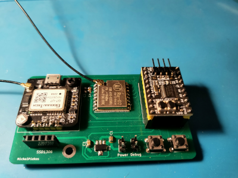

# stm32g031_LoRa_GPS
GPS position transmitter using LoRa. Based on STM32G031 controller with HAL and Makefile.

## Testing
In current development stage it is still testing rig.
I have included SSD1306 Oled for debugging in the field.
Included PCB design made in KiCAD.
